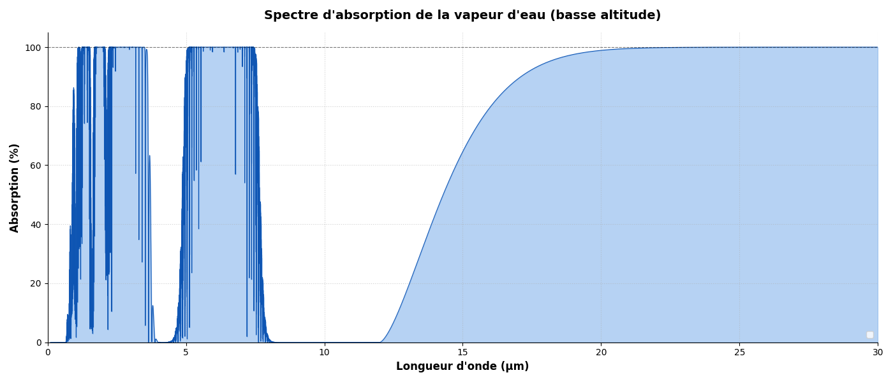

# Absorbance du CO2

Le script CO2 a ete deplace dans `modele1/codes_python/absorbance CO2.py`,
car ses valeurs servent directement au modele 1.

[Source bande absorbance CO2](https://acces.ens-lyon.fr/acces/thematiques/CCCIC/ressources/irspco2)

b1 = [600, 760 cm $^{-1}$] ,
b2 = [2100, 2450 cm $^{-1}$] ,     
b3 = [1200, 1500 cm $^{-1}$]

## Utilité du code

Courbe d'absorbance du CO2 en fonction de la longueur d'onde, avec calcul de
l'absorbance moyenne sur les deux bandes utilisees par les modeles 1 et 2.

## Fonctionnement du code

- utilisation de l'API RADIS
- récupération de l'absorbance au niveau des bandes d'absorbance (voir lien ci-dessus)
- moyenne numerique de l'absorbance sur `14.25-15.75 µm` et `4.20-4.35 µm`

## Lancement

Depuis la racine du dépôt :

```bash
./.venv/bin/python "modele1/codes_python/absorbance CO2.py"
```

Sous Windows, depuis PowerShell :

```powershell
.\.venv\Scripts\python.exe "modele1\codes_python\absorbance CO2.py"
```

Dans un environnement non interactif (CI, sandbox), ce lancement enregistre
automatiquement `modele1/sorties/absorbance_CO2.png` au lieu d'ouvrir une
fenêtre.

Pour tester sans ouvrir de fenêtre graphique :

```bash
./.venv/bin/python "modele1/codes_python/absorbance CO2.py" --no-plot
```

Sortie utile pour les modeles 1 et 2 :

```text
absorbances_moyennes_modeles_1_2
bande, intervalle_um, absorbance_moyenne
CO2_15um, 14.25-15.75, 0.160933
CO2_4_3um, 4.20-4.35, 1.477625
```

Pour générer une image :

```bash
./.venv/bin/python "modele1/codes_python/absorbance CO2.py" --output "modele1/sorties/absorbance_CO2.png" --no-plot
```

RADIS télécharge les raies HITRAN au premier lancement. Le script stocke maintenant
ce cache dans le cache utilisateur du système :

- Windows : `%LOCALAPPDATA%\CREPES\absorbance_co2\`
- macOS/Linux : `~/.cache/crepes/absorbance_co2/`

Si un téléchargement est interrompu, relancer avec :

```bash
./.venv/bin/python "modele1/codes_python/absorbance CO2.py" --regen-cache --no-plot
```
------------------------------------------------------------------------------------------------
------------------------------------------------------------------------------------------------
# Absorbance de la vapeur d'eau 

Source des données : [hitran.org ](https://hitran.org/lbl/3?1=on)

## Utilité du code

Obtention des bandes d'absoption de la vapeur d'eau 
b1 = [1 ; 4 µm],
b2 = [5 ; 7.5 µm], et
b3 ~ [15 µm ; au-delà] 

Le graphe simplifié obtenu est le suivant : 
